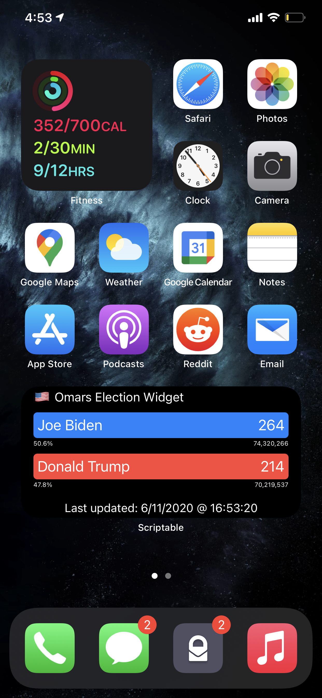
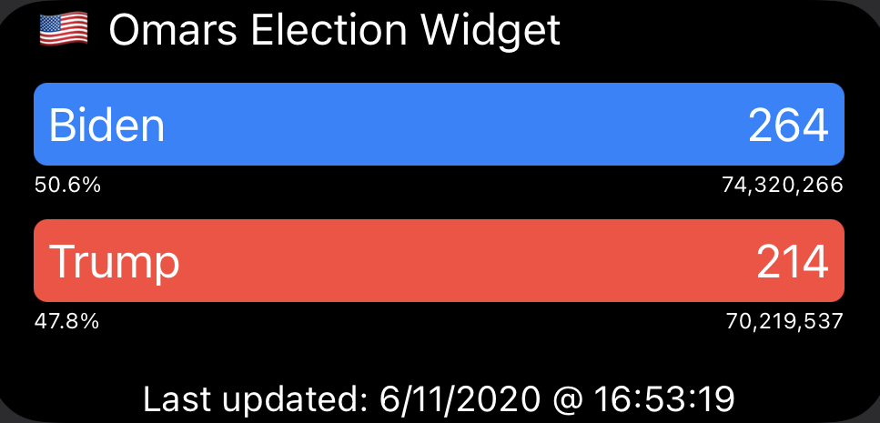

# Simple Scriptable™ Widget for IOS/Android 

# Installation 

Copy the Script to the Scriptables app and save it. 
Then add the scriptable widget. 

A similar process should be follows for Android devices. 

##  Demo

## Powered by

- [JavaScript](http://python.org)

